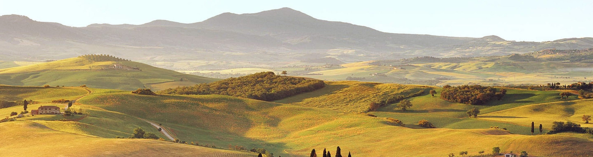

<table border="0">
  <tr>
    <td width="30%">
      
    </td>
    <td width="70%" align="center" valign="middle">
      <h1>Lei Zhang (张磊)</h1>
      <b>PhD Candidate</b> 
      <b>School of Geography and Ocean Science</b> 
      <b>Nanjing University</b> 
      <b>163 Xianlin Road, Qixia District, Nanjing 210023, China</b> 
      <!--   -->
      <b>Visiting researcher at Soil Geography and Landscape Group</b> 
      <b>Wageningen University & Research</b> 
      <!--   -->
      <b>Email：lei.zhang.geo@outlook.com; zhanglei@smail.nju.edu.cn; lei6.zhang@wur.nl</b> 
    </td>
  </tr>
</table>

[
    <!-- <a href="#News">News</a> / -->
    <a href="#Research">Research Interests</a> /
    <!-- <a href="#Education">Education</a> / -->
    <!-- <a href="#Experience">Professional Experience</a> / -->
    <a href="#Publications">Publications</a> /
    <a href="#Codes">Codes</a> /
    <!-- <a href="#Professional">Professional Service</a> / -->
    <a href="#Awards">Honors & Awards</a>
]

  

# Research Interests
- Geoscience, Remote sensing, GIScience
- Vegetation and Soil, Soil organic carbon, Interactions between vegetation, soil, climate change, and human activities
- Geostatistics, Spatial predictive model, Digital soil mapping, Spatial sampling method
- Machine learning, Deep learning

# Publications
- **Google Scholar**: [https://scholar.google.com/citations?user=aCKgi18AAAAJ&hl=en](https://scholar.google.com/citations?user=aCKgi18AAAAJ&hl=en)
- **Research Gate**: [https://www.researchgate.net/profile/Lei-Zhang-360](https://www.researchgate.net/profile/Lei-Zhang-360)
- **ORCID**: [https://orcid.org/0000-0002-1090-6338](https://orcid.org/0000-0002-1090-6338)

## As first/corresponding author:
- **Zhang, L.**, Yang, L., Zohner, C.M., Crowther, T.W., Li, M., Shen, F., Guo, M., Qin, J., Yao, L., Zhou, C., 2022. Direct and indirect impacts of urbanization on vegetation growth across the world’s cities. *Science Advances* 8, eabo0095. https://doi.org/10.1126/sciadv.abo0095
<a href="https://doi.org/10.1126/sciadv.abo0095" target="_blank">[Web]</a>
<a href="https://github.com/leizhang-geo/leizhang-geo.github.io/raw/main/articles/2022_Zhang et al._Direct and indirect impacts of urbanization on vegetation growth across the world’s cities.pdf" target="_blank">[PDF]</a>

- **Zhang, L.**, Cai, Y., Huang, H., Li, A., Yang, L., Zhou, C., 2022. A CNN-LSTM Model for Soil Organic Carbon Content Prediction with Long Time Series of MODIS-Based Phenological Variables. *Remote Sensing* 14, 4441. https://doi.org/10.3390/rs14184441
<a href="https://doi.org/10.3390/rs14184441" target="_blank">[Web]</a>
<a href="https://github.com/leizhang-geo/leizhang-geo.github.io/raw/main/articles/2022_Zhang et al._A CNN-LSTM Model for Soil Organic Carbon Content Prediction with Long Time Series of MODIS-Based Phenological Variables.pdf" target="_blank">[PDF]</a>

- **Zhang, L.**, Zhu, A.-X., Liu, J., Ma, T., Yang, L., Zhou, C., 2022. An adaptive uncertainty-guided sampling method for geospatial prediction and its application in digital soil mapping. *International Journal of Geographical Information Science* https://doi.org/10.1080/13658816.2022.2125973
<a href="https://doi.org/10.1080/13658816.2022.2125973" target="_blank">[Web]</a>
<a href="https://github.com/leizhang-geo/leizhang-geo.github.io/raw/main/articles/2022_Zhang et al._An adaptive uncertainty-guided sampling method for geospatial prediction and its application in digital soil mapping.pdf" target="_blank">[PDF]</a>

- **Zhang, L.**, Yang, L., Cai, Y., Huang, H., Shi, J., Zhou, C., 2022. A multiple soil properties oriented representative sampling strategy for digital soil mapping. *Geoderma* 406, 115531. https://doi.org/10.1016/j.geoderma.2021.115531
<a href="https://doi.org/10.1016/j.geoderma.2021.115531" target="_blank">[Web]</a>
<a href="https://github.com/leizhang-geo/leizhang-geo.github.io/raw/main/articles/2022_Zhang et al._A multiple soil properties oriented representative sampling strategy for digital soil mapping.pdf" target="_blank">[PDF]</a>

- **Zhang, L.**, Yang, L., Ma, T., Shen, F., Cai, Y., Zhou, C., 2021. A self-training semi-supervised machine learning method for predictive mapping of soil classes with limited sample data. *Geoderma* 384, 114809. https://doi.org/10.1016/j.geoderma.2020.114809
<a href="https://doi.org/10.1016/j.geoderma.2020.114809" target="_blank">[Web]</a>
<a href="https://github.com/leizhang-geo/leizhang-geo.github.io/raw/main/articles/2021_Zhang et al._A self-training semi-supervised machine learning method for predictive mapping of soil classes with limited sample data.pdf" target="_blank">[PDF]</a>

- **Zhang, L.**, Na, J., Zhu, J., Shi, Z., Zou, C., Yang, L., 2021. Spatiotemporal causal convolutional network for forecasting hourly PM2.5 concentrations in Beijing, China. *Computers & Geosciences* 155, 104869. https://doi.org/10.1016/j.cageo.2021.104869
<a href="https://doi.org/10.1016/j.cageo.2021.104869" target="_blank">[Web]</a>
<a href="https://github.com/leizhang-geo/leizhang-geo.github.io/raw/main/articles/2021_Zhang et al._Spatiotemporal causal convolutional network for forecasting hourly PM2.pdf" target="_blank">[PDF]</a>

- **张磊**, 朱阿兴, 琳杨, 秦承志, 刘军志, 刘雪琦, 2017. 基于分融策略的土壤采样设计方法. *土壤学报* 54, 1079–1090. https://doi.org/10.11766/trxb201701030562
<a href="https://doi.org/10.11766/trxb201701030562" target="_blank">[Web]</a>
<a href="https://github.com/leizhang-geo/leizhang-geo.github.io/raw/main/articles/2017_张磊 et al._基于分融策略的土壤采样设计方法.pdf" target="_blank">[PDF]</a>

## As co-author:
- Shen, F., Yang, L., **Zhang, L.**, Guo, M., Huang, H., Zhou, C., 2023. Quantifying the direct effects of long-term dynamic land use intensity on vegetation change and its interacted effects with economic development and climate change in jiangsu, China. Journal of Environmental Management 325, 116562. https://doi.org/10.1016/j.jenvman.2022.116562
<a href="https://doi.org/10.1016/j.jenvman.2022.116562" target="_blank">[Web]</a>
<a href="https://github.com/leizhang-geo/leizhang-geo.github.io/raw/main/articles/co/2023_Shen et al._Quantifying the direct effects of long-term dynamic land use intensity on vegetation change and its interacted effects.pdf" target="_blank">[PDF]</a>

- Wu, Q., Miao, S., Huang, H., Guo, M., **Zhang, L.**, Yang, L., Zhou, C., 2022. Quantitative Analysis on Coastline Changes of Yangtze River Delta based on High Spatial Resolution Remote Sensing Images. *Remote Sensing* 14, 310. https://doi.org/10.3390/rs14020310
<a href="https://doi.org/10.3390/rs14020310" target="_blank">[Web]</a>
<a href="https://github.com/leizhang-geo/leizhang-geo.github.io/raw/main/articles/co/2022_Wu et al._Quantitative Analysis on Coastline Changes of Yangtze River Delta based on High Spatial Resolution Remote Sensing Images.pdf" target="_blank">[PDF]</a>

- Guo, M., Yang, L., Shen, F., **Zhang, L.**, Li, A., Cai, Y., Zhou, C., 2022. Impact of socio-economic environment and its interaction on the initial spread of COVID-19 in mainland China. *Geospatial Health* 17. https://doi.org/10.4081/gh.2022.1060
<a href="https://doi.org/10.4081/gh.2022.1060" target="_blank">[Web]</a>
<a href="https://github.com/leizhang-geo/leizhang-geo.github.io/raw/main/articles/co/2022_Guo et al._Impact of socio-economic environment and its interaction on the initial spread of COVID-19 in mainland China.pdf" target="_blank">[PDF]</a>

- Yang, L., Shen, F., **Zhang, L.**, Cai, Y., Yi, F., Zhou, C., 2021. Quantifying influences of natural and anthropogenic factors on vegetation changes using structural equation modeling: A case study in Jiangsu Province, China. *Journal of Cleaner Production* 280, 124330. https://doi.org/10.1016/j.jclepro.2020.124330
<a href="https://doi.org/10.1016/j.jclepro.2020.124330" target="_blank">[Web]</a>
<a href="https://github.com/leizhang-geo/leizhang-geo.github.io/raw/main/articles/co/2021_Yang et al._Quantifying influences of natural and anthropogenic factors on vegetation changes using structural equation modeling.pdf" target="_blank">[PDF]</a>

- Yang, L., Cai, Y., **Zhang, L.**, Guo, M., Li, A., Zhou, C., 2021. A deep learning method to predict soil organic carbon content at a regional scale using satellite-based phenology variables. *International Journal of Applied Earth Observation and Geoinformation* 102, 102428. https://doi.org/10.1016/j.jag.2021.102428
<a href="https://doi.org/10.1016/j.jag.2021.102428" target="_blank">[Web]</a>
<a href="https://github.com/leizhang-geo/leizhang-geo.github.io/raw/main/articles/co/2021_Yang et al._A deep learning method to predict soil organic carbon content at a regional scale using satellite-based phenology variables.pdf" target="_blank">[PDF]</a>

- Yang, L., Li, X., Yang, Q., **Zhang, L.**, Zhang, S., Wu, S., Zhou, C., 2021. Extracting knowledge from legacy maps to delineate eco-geographical regions. *International Journal of Geographical Information Science* 35, 250–272. https://doi.org/10.1080/13658816.2020.1806284
<a href="https://doi.org/10.1080/13658816.2020.1806284" target="_blank">[Web]</a>
<a href="https://github.com/leizhang-geo/leizhang-geo.github.io/raw/main/articles/co/2021_Yang et al._Extracting knowledge from legacy maps to delineate eco-geographical regions.pdf" target="_blank">[PDF]</a>

- He, X., Yang, L., Li, A., **Zhang, L.**, Shen, F., Cai, Y., Zhou, C., 2021. Soil organic carbon prediction using phenological parameters and remote sensing variables generated from Sentinel-2 images. *CATENA* 205, 105442. https://doi.org/10.1016/j.catena.2021.105442
<a href="https://doi.org/10.1016/j.catena.2021.105442" target="_blank">[Web]</a>
<a href="https://github.com/leizhang-geo/leizhang-geo.github.io/raw/main/articles/co/2021_He et al._Soil organic carbon prediction using phenological parameters and remote sensing variables generated from Sentinel-2 images.pdf" target="_blank">[PDF]</a>

- Ma, T., Brus, D.J., Zhu, A.-X., **Zhang, L.**, Scholten, T., 2020. Comparison of conditioned Latin hypercube and feature space coverage sampling for predicting soil classes using simulation from soil maps. *Geoderma* 370, 114366. https://doi.org/10.1016/j.geoderma.2020.114366
<a href="https://doi.org/10.1016/j.geoderma.2020.114366" target="_blank">[Web]</a>
<a href="https://github.com/leizhang-geo/leizhang-geo.github.io/raw/main/articles/co/2020_Ma et al._Comparison of conditioned Latin hypercube and feature space coverage sampling for predicting soil classes using simulation from.pdf" target="_blank">[PDF]</a>

# Codes
- Direct and indirect impacts of urbanization on vegetation growth across the world’s cities \
**Global urban vegetation analysis** <[Code](https://github.com/leizhang-geo/Global_Urbanization_Impacts_on_Vegetation.git)>

- A CNN-LSTM model for soil organic carbon content prediction using phenological variables \
**A CNN-LSTM model for SOC preditive mapping** <[Code](https://github.com/leizhang-geo/CNN-LSTM_for_DSM.git)>

- An Adaptive uncertainty-guided sampling (AUGSS) method for geospatial prediction and its application in digital soil mapping \
**Uncertainty-guided sampling method** <[Code](https://github.com/leizhang-geo/uncertainty_guided_sampling.git)>

- Spatiotemporal causal convolutional network for predicting air pullution (PM2.5) concentrations \
**ST-CausalConvNet** <[Code](https://github.com/leizhang-geo/ST-CausalConvNet.git)>

# Honors & Awards
- Awarded as a visiting researcher at Wageningen University & Research (Soil Geography and Landscape Group) funded by the China Scholarship Council, 2022-2023.

- Awarded as Promising Young Scholar in GIS at the 10th GIS Forum for Colleges and Universities, 2022.

- First Prize in Best Paper Award in conference of graduate students of geographic information science in Jiangsu, China, 2017. Awarded by Geographical Society of China.

- First Prize in Outstanding Graduate Thesis Award of Jiangsu province in China, 2016. Awarded by the Ministry of Education.

- Global GIS Young Scholar Award (Jack Dangermond’s special award), in San Diego, USA, 2015 (No. 11 in: [Link](http://www.arcgis.com/apps/MapTour/index.html?appid=a383612f79354488929beabcd266cd77))

- First Prize in the ESRI GIS Spatial Analysis Contest in China (team leader), 2014. Awarded by ESRI and Geographical Society of China
